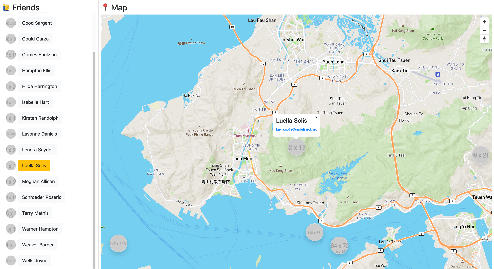

# 📍 FriendsMap

[](https://friendsmap-d30b0.firebaseapp.com/)



A simple, static, single-page application that shows an interactive map of friends.

This challenge was taken from [ moovup / programming-test ](https://github.com/moovup/programming-test).

## 📦 Files

```
.
├── README.md
├── assets
│   └── screenshot.png
├── css
│   └── styles.css
├── index.html
└── js
    ├── obfuscated.js
    └── original.js
```

1. **`/README.md`** - The current document.
2. **`/index.html`** - The primary HTML document.
3. **`/css/styles.css`** - The stylesheet to add more tweaks.
4. **`/js/original.js`** - The JavaScript source that defines the functions.
    - Includes a MapBox token with URL restrictions set.
5. **`/js/obfuscated.js`** - An obfuscated version of `original.js` used for deployment.
6. **`/assets/screenshots.png`** - A screenshot of the hosted app.

## 🎓 Acknowledgement

- **Bootstrap**: [Github](https://github.com/twbs/bootstrap) | [Documentation](https://getbootstrap.com/docs/4.5/getting-started/introduction/)
    - *A front-end framework for building responsive sites.*
    - Used to handle styling efficiently.

- **Mapbox GL JS**: [Github](https://github.com/mapbox/mapbox-gl-js) | [Documentation](https://docs.mapbox.com/mapbox-gl-js/api/)
    - *A JavaScript library for interactive, customizable vector maps on the web.*
    - My very first try of using a map provider and handling GeoJson.

    